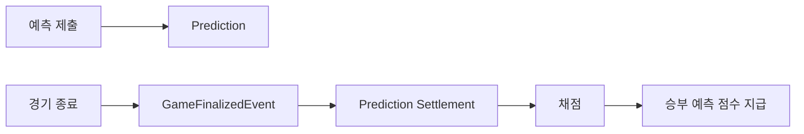
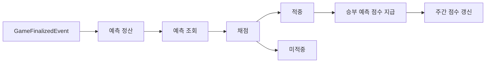
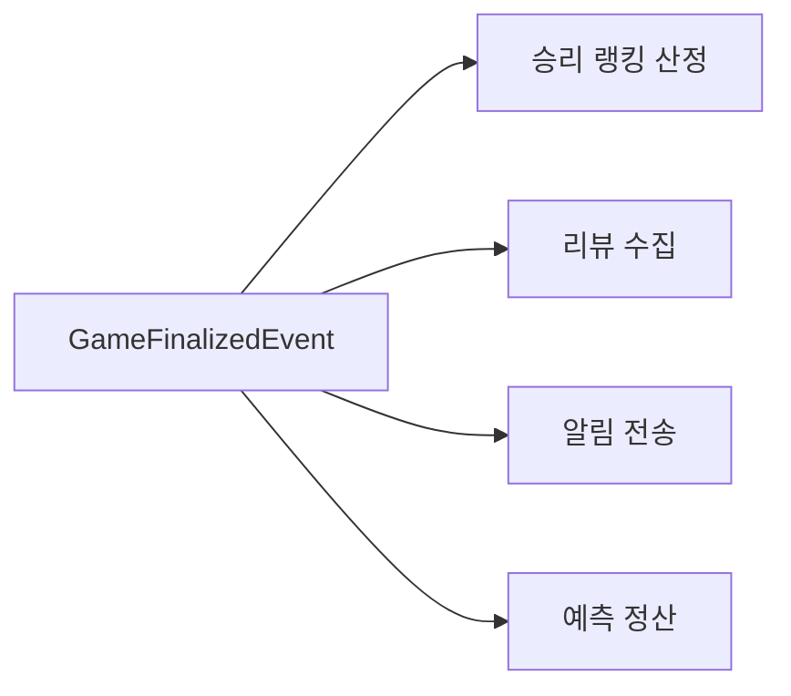
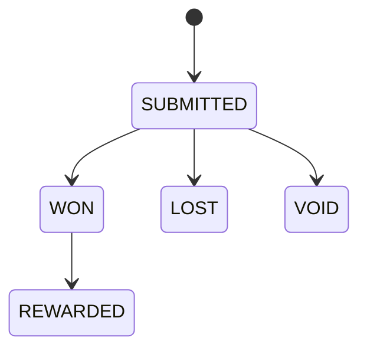
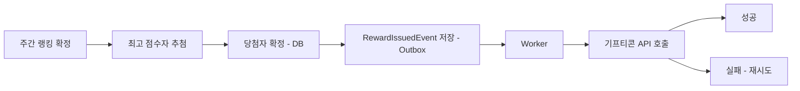

# 승부 예측 & 보상 시스템 - 엔지니어링 설계

이 문서는 **승부 예측 & 보상 시스템**의 구현을 위한 설계 내용을 담고 있습니다.

기능과 관련된 세부 요구사항은 별도의 기획 문서에서 정의하며, 여기서는 **데이터의 일관성, 이벤트 처리 방식, 동시성 문제, 그리고 시스템 확장성**을 중심으로 설계 방향과 선택의 이유를 설명합니다.

---

## 1. 시스템 구성

승부 예측은 크게 두 가지 단계로 진행됩니다.

- 경기 시작 전에는 사용자가 자신의 예측을 등록합니다.
- 경기 종료 후에는 예측 결과를 채점하고 적절한 보상을 지급합니다.

예측 시스템은 경기의 종료 여부를 직접 확인하는 방식이 아니라, **경기 종료 이벤트가 발생하면 그 시점을 기준으로 후속 작업을 처리**합니다.

이렇게 하면 불필요한 데이터 조회를 줄이고, 전체 시스템의 효율성과 일관성도 높일 수 있습니다.



이 구조를 도입하면 경기 서비스와 예측 서비스가 느슨하게 연결되기 때문에, 경기 종료 후 필요한 기능들도 동일한 이벤트를 구독하며 각자 독립적으로 확장할 수 있습니다.

---

# **2. 해결해야 할 문제**

승부 예측 기능은 단순히 결과를 저장하는 CRUD 서비스가 아닙니다.  
실제 서비스를 운영하다 보면 아래와 같은 다양한 문제들이 등장합니다.

| **문제**     | **발생 상황**                             |
|------------|---------------------------------------|
| **마감 정합성** | 경기 시작 후에는 예측이 저장되면 안 됨                |
| **중복 제출**  | 한 사용자가 동시에 여러 번 요청할 수 있음              |
| **멱등성**    | 정산을 여러 번 실행해도 보상은 한 번만 지급되어야 함        |
| **동시성**    | 많은 사용자가 동시에 예측을 제출할 때 실시간 통계가 깨질 수 있음 |
| **추첨 정합성** | 주간 랭킹 확정 후 당첨자를 중복 없이, 한 번만 선정해야 함     |
| **외부 연동**  | 기프티콘 지급은 외부 API 호출이라 DB 트랜잭션과 묶을 수 없음  |
| **확장성**    | 경기 종료 후 처리해야 할 작업이 계속 늘어남             |

이후에는 각 문제를 어떻게 해결했는지 하나씩 설명합니다.

---

# **3. 마감 정합성**

비즈니스 규칙 중에서 가장 중요한 건 **경기가 시작된 이후에는 더 이상 예측을 제출하거나 수정할 수 없다는 점**입니다.

이 규칙이 지켜지지 않으면, 사용자가 경기 결과를 확인한 뒤에도 예측을 바꿀 수 있기 때문에, 예측 시스템의 신뢰가 완전히 무너질 수 있습니다.

그래서 모든 제출이나 수정 요청이 들어올 때마다, 꼭 트랜잭션 내부에서 한 번 더 경기의 시작 시간을 확인해야 합니다.

```text
현재 시간 < 경기 시작 시간
    → 저장 허용

현재 시간 ≥ 경기 시작 시간
    → 저장 거절
```

이때 기준이 되는 시각은 항상 **서버 시간**이어야 합니다. 클라이언트 시간은 믿을 수 없으니 사용하지 않습니다.

그리고 경기가 시작된 후에는 예측을 수정하거나 삭제할 수 없도록 막아서, 결과가 나중에 바뀌는 일이 없게끔 예측의 불변성을 끝까지 보장합니다.

---

# **4. 중복 제출**

한 사용자는 같은 경기에 대해서 예측을 한 번만 제출할 수 있습니다.

앱에서 먼저 예측이 있는지 확인한 다음 저장하더라도, 거의 동시에 여러 요청이 들어오면 중복 저장이 발생할 수 있습니다.

그래서 최종적으로는 데이터베이스의 **`UNIQUE(member_id, game_id)`** 제약으로 중복을 막는 것이 안전합니다.

이렇게 하면 네트워크 재시도나 중복 요청이 발생하더라도, 한 경기에 여러 개의 예측이 저장되는 걸 원천적으로 방지할 수 있습니다.

---

# **5. 정산**

예측 시스템은 경기 종료를 직접 확인하지 않습니다.

경기가 끝나면 경기 서비스가 **GameFinalizedEvent**를 발행하고, 예측 시스템은 이 이벤트를 받아서 정산 과정을 시작합니다.



이벤트 하나로 여러 기능을 만들어 쓸 수 있기 때문에, 경기 종료 로직을 건드리지 않고도 새로운 기능을 쉽게 추가할 수 있습니다.



결국 **경기 서비스는 경기 종료 사실만 알려주고, 실제로 어떤 처리가 일어날지는 각 Consumer가 맡는 구조**입니다.

---

# **6. 멱등성**

이벤트가 장애 복구나 재시도로 여러 번 전달될 수 있다 보니, 정산을 중복해서 실행하더라도 승부 예측 점수는 반드시 한 번만 지급되어야 합니다.

이를 위해, 보상 지급 내역을 별도의 원장에 따로 저장하고, **prediction_id**를 고유 키로 사용합니다.

```text
prediction_rewards

UNIQUE(prediction_id)
```

이미 지급된 보상에 대해서는 Insert가 아예 실패하므로, 중복 지급이 자연스럽게 막힙니다.

또, 예측의 상태는 한 방향으로만 바뀌도록 설계했습니다.



이처럼 **상태 전이와 보상 원장을 함께 사용**하면, 정산 작업이 여러 차례 반복돼도 항상 같은 결과를 보장할 수 있습니다.

주간 점수도 별도의 카운터를 두고 매주 초기화하는 방식은 쓰지 않습니다. 초기화 배치가 실패하거나 시점이 어긋나면 점수가 잘못 섞일 수 있기 때문입니다.

대신 주간 점수는 `prediction_rewards`에 쌓인 데이터를 주(week) 단위로 집계해서 구합니다.

```text
주간 점수 = SUM(points) FROM prediction_rewards
            WHERE settled_at BETWEEN 이번 주 시작 AND 이번 주 끝
            GROUP BY member_id
```

이렇게 하면 "초기화"라는 별도의 쓰기 작업이 필요 없어집니다. 새로운 주가 시작되면 집계 범위만 자연스럽게 바뀌고, 지난 주 데이터는 그대로 남아있기 때문에 몇 번을 다시 계산해도 같은 결과가 나옵니다.

---

# **7. 동시성**

예측을 제출할 때는 대부분 서로 다른 Row가 생성되기 때문에 충돌이 거의 일어나지 않습니다.

실제로 병목이 생기는 순간은 여러 사용자가 **같은 데이터를 동시에 수정하려고 할 때**입니다.

| **구간**    | **문제**              | **해결 방법**                 |
|-----------|---------------------|---------------------------|
| 실시간 예측 비율 | Lost Update         | Atomic Update → Redis 카운터 |
| 정산        | 여러 Worker가 동일 예측 처리 | `FOR UPDATE SKIP LOCKED`  |
| 주간 추첨     | 중복 실행으로 당첨자 중복 선정   | 단일 스케줄러 실행 + `UNIQUE(member_id, week)` 원장 |
| 선착순 보상    | 재고 초과 지급            | Atomic Update / 분산 락      |

즉, 이 기능에서 동시성 관련 문제는 **예측 저장보다 집계와 정산 과정**에서 주로 발생합니다.

---

# **8. 주간 보상과 외부 연동**

주간 랭킹이 확정되면, 최고 점수를 기록한 사용자들 중 3명을 추첨해 치킨 기프티콘을 지급합니다.

이 지점부터는 지금까지와 성격이 다른 문제가 등장합니다. 여기까지의 정산은 모두 우리 시스템 내부(DB)에서 끝나는 작업이었지만, 기프티콘 지급은 **외부 벤더 API를 호출**해야 하는 작업이기 때문입니다.

당첨자를 확정하는 것(DB Write)과 기프티콘을 발급하는 것(외부 API Call)은 성격이 다른 두 작업이라 하나의 트랜잭션으로 묶을 수 없습니다.

- DB 트랜잭션 안에서 외부 API를 호출하면, API 응답이 느려질 때 트랜잭션이 길어지고 락이 오래 유지됩니다.
- 반대로 DB 커밋 이후에 외부 API를 호출하면, **커밋은 성공했는데 API 호출만 실패**하는 상황이 생길 수 있습니다. 이러면 당첨은 됐는데 기프티콘은 못 받는 사용자가 생깁니다.



그래서 당첨자 확정과 기프티콘 발급 사이에 **Outbox**를 둡니다.

- 당첨자를 확정하면서, 같은 트랜잭션 안에서 `RewardIssuedEvent`를 Outbox 테이블에 저장합니다.
- Worker가 Outbox를 폴링해서 이벤트를 읽고, 그때 기프티콘 API를 호출합니다.
- API 호출이 실패해도 이벤트는 Outbox에 그대로 남아있기 때문에, 재시도만으로 복구할 수 있습니다.
- API 호출이 성공하면 이벤트를 처리 완료로 표시해서, 같은 이벤트로 기프티콘이 중복 발급되지 않게 합니다.
- 당첨자 원장에는 `UNIQUE(member_id, week)` 제약을 둬서, 추첨이 중복 실행되더라도 같은 사람이 같은 주에 두 번 당첨되지 않도록 막습니다.

결국 이 구조 덕분에 당첨자 확정(DB)과 기프티콘 지급(외부 API)이 분리되어도, **"당첨은 됐는데 기프티콘을 못 받는" 상황을 만들지 않을 수 있습니다.**

여기서 중요한 건, Outbox를 기술적으로 도입하고 싶어서 가져온 게 아니라는 점입니다. 주간 보상이라는 기능 요구사항 자체가 **DB 트랜잭션과 외부 API 호출을 분리해야 하는 상황**을 만들었고, 그 문제를 안전하게 풀기 위한 방법으로 Outbox를 선택한 것입니다.

---

# **9. 확장 전략**

MQ나 분산 락처럼 복잡한 기술을 처음부터 도입하지는 않습니다.

서비스가 성장하고 실제 문제가 나타나기 시작하면, 그때 그 상황에 맞는 기술을 단계적으로 적용해 나갑니다.

| **단계**  | **발생하는 문제**   | **해결 방법** |
|---------|---------------|-----------|
| CRUD    | 핵심 기능 구현      | -         |
| 중복 제출   | 동일 경기 중복 예측   | UNIQUE    |
| 마감      | 경기 시작 후 제출    | 서버 시간 검증  |
| 정산      | 중복 보상 지급      | 멱등성       |
| 실시간 통계  | 집계 병목 현상      | Redis 카운터 |
| 외부 연동   | 기프티콘 지급 실패 시 유실 | Outbox    |
| 대량 정산   | Worker 처리량 부족 | MQ        |
| 선착순 이벤트 | 재고 경쟁         | 분산 락      |

Outbox만은 예외적으로 처음부터 들어갑니다. 다른 항목들은 트래픽이 늘면서 드러나는 문제지만, 기프티콘 지급은 **주간 보상이라는 요구사항 자체가 처음부터 외부 API 호출을 필요로 하기 때문**입니다. 이 요구사항이 없었다면 Outbox 도입도 실시간 통계 이후 단계로 미뤄졌을 것입니다.

여기서 중요한 건, **당장 필요하지 않은 기술을 미리 끌어오지 않는다는 점**입니다.

문제가 드러나면 가장 단순한 방식부터 시도하고, 서비스가 커지면 MQ, 분산 락 같은 기술을 하나씩 추가하면서 점진적으로 확장해 나가는 전략을 씁니다.

---

# **10. 왜 이 기능을 테스트베드로 선택했는가**

승부 예측 기능을 선택한 이유는, 실제 서비스에서 흔히 겪는 다양한 문제를 이 한 기능 안에서 대부분 실험해볼 수 있기 때문입니다.

| **설계 주제**   | **검증 내용**                 |
|-------------|---------------------------|
| 트랜잭션        | 경기 시작 후 제출 막기             |
| 데이터 정합성     | 경기당 1인 1예측 보장             |
| 이벤트 기반 아키텍처 | GameFinalizedEvent로 정산 진행 |
| 멱등성         | 중복 보상 지급 방지               |
| 동시성         | 실시간 예측 비율 집계, 주간 추첨 중복 방지 |
| 외부 연동       | Outbox로 기프티콘 API 호출 안전하게 재시도 |
| 메시징         | Outbox에서 MQ로 확장           |
| 분산 시스템      | 선착순 보상 구현                 |

기존에는 **GameFinalizedEvent**가 **이벤트를 안전하게 전달하는 구조**를 검증하는 용도였다면, 승부 예측 기능은 **이벤트를 받은 뒤 실제 비즈니스 로직이 얼마나 안전하게 처리되는지**까지 점검할
수 있습니다.

결국 이 기능은 **트랜잭션, 이벤트 아키텍처, 멱등성, 동시성, 외부 연동, 확장 전략 등 중요한 요구사항**을 한 도메인 안에서 단계별로 검증할 수 있는 좋은 테스트베드로 활용할 수 있습니다.
