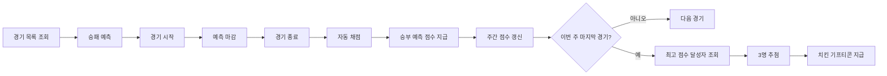

# **승부 예측 & 주간 보상 시스템**

사용자가 경기 시작 전에 승패를 예측하고, 경기 종료 후 예측 결과에 따라 **승부 예측 점수**를 획득하는 참여형 이벤트 기능입니다.

매주 최고 점수를 기록한 사용자들 중 추첨을 통해 치킨 기프티콘을 지급하여, 지속적인 참여와 경쟁을 유도합니다.

---

# **1. 배경**

지금까지 야구보구는 경기 정보 조회, 직관 기록, 리뷰 작성 등 **경기 이후의 경험**에 집중해 서비스를 제공해왔습니다.

이번 승부 예측 기능은 사용자가 **경기 시작 전부터 서비스에 참여**하도록 만들고, 경기 종료 후 결과와 랭킹을 확인하기 위해 다시 방문하도록 유도하는 것을 목표로 합니다.

또한 주간 보상 시스템을 통해 단순히 한 경기만 참여하는 것이 아니라, **일주일 동안 꾸준히 예측에 참여하는 경험**을 제공합니다.

---

# **2. 목표**

승부 예측은 단순히 경기 결과를 맞히는 기능이 아니라, 경기 전후의 사용자 경험을 연결하는 것을 목표로 합니다.

이를 위해 다음과 같은 경험을 제공합니다.

- 경기 시작 전에 승패를 예측합니다.
- 경기 종료 후 자동으로 예측 결과를 확인합니다.
- 예측 성공 시 승부 예측 점수를 획득합니다.
- 점수는 매주 누적되며 주간 랭킹에 반영됩니다.
- 매주 최고 점수를 기록한 사용자들 중 추첨을 통해 치킨 기프티콘을 제공합니다.

---

# **3. 사용자 흐름**

---

# **4. 기능 요구사항**

## **예측**

- 사용자는 경기마다 **승리 팀(홈/원정)** 을 예측할 수 있습니다.
- **한 사용자는 같은 경기에 한 번만 참여할 수 있습니다.**
- **경기 시작 전까지만** 예측을 제출하거나 수정할 수 있습니다.
- **경기 시작 이후에는 제출, 수정, 삭제가 불가능합니다.**
- 사용자는 자신의 예측 내역과 참여 시간을 확인할 수 있습니다.

---

## **정산**

- 경기가 종료되면 시스템이 자동으로 예측 결과를 채점합니다.
- **예측에 성공한 사용자에게 승부 예측 점수를 지급합니다.**
- 지급된 점수는 해당 주의 랭킹에 즉시 반영됩니다.
- **경기가 취소될 경우 모든 예측은 무효 처리됩니다.**
- 운영자가 경기 결과를 변경하면 정산 결과와 주간 점수도 다시 반영할 수 있습니다.

---

## **주간 보상**

- 승부 예측 점수는 **매주 누적**됩니다.
- 매주 마지막 경기 종료 후 **주간 랭킹을 확정**합니다.
- **최고 점수를 기록한 사용자들 중 추첨을 통해 3명에게 치킨 기프티콘을 지급합니다.**
- 새로운 주가 시작되면 승부 예측 점수는 초기화됩니다.

---

# **5. 운영 정책**

|**항목**|**내용**|
|---|---|
|예측 대상|승패(홈/원정)|
|참여 횟수|경기당 1회|
|수정 가능|경기 시작 전까지|
|마감 시점|경기 시작 시각|
|점수 지급|예측 성공 시 지급|
|점수 집계|주간 누적|
|주간 보상|최고 점수 달성자 중 추첨 3명|
|보상|치킨 기프티콘|
|점수 초기화|매주|
|취소 경기|예측 무효|

---

# **6. 범위**

### **포함**

- 경기 목록 조회
- 승패 예측
- 예측 수정
- 경기 시작 시 자동 마감
- 경기 종료 후 자동 채점
- 승부 예측 점수 지급
- 주간 랭킹 집계
- 최고 점수 달성자 추첨
- 치킨 기프티콘 지급

### **제외**

- 점수 예측
- MVP 예측
- 이닝별 예측
- 시즌 랭킹
- 배지
- 굿즈 교환
- 기타 이벤트

---

# **7. 향후 확장**

향후에는 승부 예측을 다양한 이벤트와 연계할 수 있습니다.

- 점수 예측
- MVP 맞히기
- 이닝별 결과 예측
- 시즌 랭킹
- 배지 시스템
- 굿즈 교환
- 승부 예측 리그
- 제휴 이벤트
