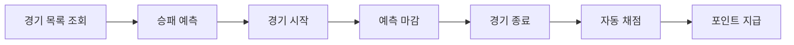

# **승부 예측 & 보상 시스템**

사용자가 경기 시작 전에 승패를 예측하고, 경기 종료 후 결과에 따라 포인트를 받는 참여형 이벤트 기능

---

# **1. 배경**

지금까지 야구보구는 경기 정보 조회, 직관 기록, 리뷰 작성 등 주로 **경기 이후의 경험**에 초점을 맞춰 서비스를 제공해왔습니다.

이제 승부 예측 기능을 통해 사용자가 **경기 시작 전부터 서비스에 더 쉽게 참여**할 수 있도록 기획했습니다.

이 기능은 경기 결과를 기다리는 동안 서비스 이용에 재미를 더하고, 경기가 끝나면 결과를 확인하기 위해 사용자가 다시 방문하도록 유도합니다. 지급된 포인트는 추후 다양한 기능과 연계해, 서비스 이용을 자연스럽게 이어가는 기반이 됩니다.

# **2. 목표**

승부 예측 기능은 단순히 경기 결과를 맞히는 게임이 아니라, 경기 전후로 사용자가 서비스에 자연스럽게 참여하도록 이끄는 데 목적이 있습니다.

이를 위해 다음과 같은 경험을 제공합니다.

- 경기 시작 전, 사용자가 승패를 예측합니다.
- 경기 결과를 기다리는 동안 설렘과 재미를 느낄 수 있습니다.
- 경기가 끝나면 결과가 자동으로 확인됩니다.
- 예측이 맞으면 포인트를 받을 수 있습니다.
- 받은 포인트는 향후 다양한 기능에서 쓸 수 있습니다.

# **3. 사용자 흐름**

사용자는 경기 시작 전에 원하는 경기의 승패를 예측합니다.

경기가 시작되면 예측은 자동으로 마감되어, 그 이후로는 더 이상 변경할 수 없습니다.

경기 종료 후에는 시스템이 자동으로 결과를 채점해, 예측에 성공한 사용자에게 포인트를 지급합니다.

---

# **4. 기능 요구사항**

## **예측**

- 사용자는 경기마다 **승리 팀(홈/원정)** 을 예측할 수 있습니다.
- **한 사용자는 같은 경기에 한 번만 참여할 수 있습니다.**
- **경기 시작 전까지만** 예측을 제출하거나 수정할 수 있습니다.
- **경기 시작 이후에는 제출, 수정, 삭제가 불가합니다.**
- 사용자는 본인의 제출 내역과 예측 참여 시간을 확인할 수 있습니다.

## **정산**

- 경기가 끝나면 시스템이 자동으로 예측 결과를 채점합니다.
- **예측에 성공한 모든 사용자에게 동일한 포인트를 지급합니다.**
- **경기가 취소될 경우, 모든 예측은 무효 처리되고 보상도 지급하지 않습니다.**
- 운영자가 경기 결과를 변경하면, 정산 결과 역시 다시 반영할 수 있습니다.

## **보상**

초기 버전에서는 포인트만 지급합니다.

추후 획득한 포인트로 다음과 같은 기능과 연계할 수 있습니다.

- 시즌 랭킹
- 배지
- 이벤트 응모
- 굿즈 교환

# **5. 운영 정책**

|**항목**|**내용**|
|---|---|
|예측 대상|승패(홈/원정)|
|참여 횟수|**경기당 1회**|
|수정 가능|**경기 시작 전까지**|
|마감 시점|**경기 시작 시각**|
|보상 대상|**예측 성공 사용자 전원**|
|보상 방식|동일 포인트 지급|
|취소 경기|**예측 무효 및 보상 미지급**|

---

# **6. 범위**

이번 기능에서는 사용자가 승패를 예측하고 포인트를 받는 경험에 집중합니다.

### **포함**

- 경기 목록 조회
- 승패 예측
- 예측 수정
- 경기 시작 시 자동 마감
- 경기 종료 후 자동 채점
- 포인트 지급

### **제외**

- 점수 예측
- MVP 예측
- 이닝별 예측
- 시즌 랭킹
- 배지
- 선착순 이벤트
- 굿즈 교환

# **7. 향후 확장**

승부 예측 기능은 처음에는 포인트 지급에서 출발하지만, 앞으로 훨씬 다양한 이벤트로 발전할 수 있습니다.

- 스코어 예측
- MVP 맞히기
- 이닝별 결과 예측
- 시즌 누적 랭킹 운영
- 선착순 굿즈 증정 이벤트
- 승부 예측 리그
- 시즌별 보상 시스템

이처럼 향후에는 이용자들이 더욱 다양한 방식으로 참여하고, 재미를 느낄 수 있는 기능들이 단계적으로 추가될 예정입니다.

