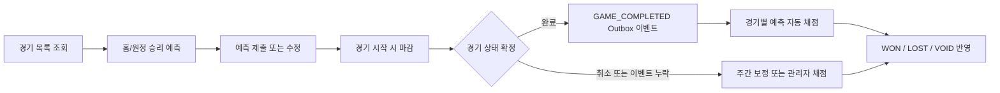
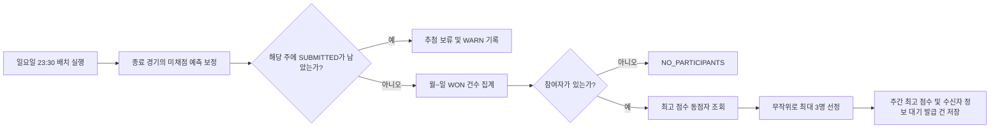
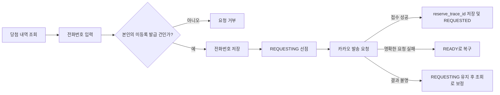

# 승부 예측 & 주간 보상 시스템

사용자가 경기 시작 전에 승패를 예측하고, 경기 종료 후 예측 결과에 따라 주간 점수를 획득하는 참여형 이벤트 기능입니다.

매주 최고 점수를 기록한 사용자 중 최대 3명을 추첨해 치킨 기프티콘 발급 대상으로 확정함으로써 지속적인 참여와 경쟁을 유도합니다.

---

# 1. 배경

지금까지 야구보구는 경기 정보 조회, 직관 기록, 리뷰 작성 등 경기 이후의 경험에 집중해 서비스를 제공해왔습니다.

승부 예측 기능은 사용자가 경기 시작 전부터 서비스에 참여하고, 경기 종료 후 예측 결과와 주간 성과를 확인하기 위해 다시 방문하도록 만드는 것을 목표로 합니다.

주간 보상은 한 경기의 결과에만 집중하지 않고 일주일 동안 꾸준히 예측에 참여할 동기를 제공합니다.

---

# 2. 목표

- 경기 시작 전에 홈 또는 원정 팀의 승리를 예측할 수 있습니다.
- 경기 종료 또는 취소 후 예측 결과를 자동으로 채점합니다.
- 적중한 예측 수를 월요일부터 일요일까지 집계해 주간 점수로 사용합니다.
- 주간 최고 점수 달성자 중 최대 3명을 추첨해 보상 발급 대상으로 확정합니다.
- 자동 채점이나 정기 추첨이 누락돼도 운영자가 안전하게 복구할 수 있습니다.
- 동일 경기의 중복 예측과 동일 주차의 중복 추첨을 방지합니다.

---

# 3. 용어와 상태

## 3.1 예측 상태

| 상태 | 의미 |
| --- | --- |
| `SUBMITTED` | 제출됐지만 아직 채점되지 않은 예측 |
| `WON` | 예측 적중 |
| `LOST` | 예측 실패 |
| `VOID` | 무승부 또는 취소 경기로 무효 처리된 예측 |

## 3.2 주간 추첨 결과

| 결과 | 의미 |
| --- | --- |
| `DRAWN` | 당첨 결과를 새로 확정함 |
| `ALREADY_DRAWN` | 다른 실행을 포함해 이미 해당 주의 추첨이 확정됨 |
| `UNGRADED_PREDICTIONS_EXIST` | 해당 주에 `SUBMITTED` 예측이 남아 추첨하지 않음 |
| `NO_PARTICIPANTS` | 집계할 적중 예측이 없어 추첨 기록을 만들지 않음 |

## 3.3 기프티콘 발급 상태

| 상태 | 의미 | 현재 구현 |
| --- | --- | --- |
| `AWAITING_RECIPIENT_INFO` | 당첨됐지만 수신자 전화번호가 등록되지 않음 | 추첨 시 생성 |
| `READY` | 수신자 전화번호가 등록돼 발급을 요청할 수 있음 | 전화번호 등록 시 전이 |
| `REQUESTING` | 외부 발급 요청을 수행 중이거나 결과 확인이 필요함 | 외부 API 호출 직전 전이 |
| `REQUESTED` | 외부 발급 요청이 접수됨 | 카카오 `200 OK` 수신 시 전이 |
| `DELIVERED` | 지급 완료 | 상태만 정의 |
| `FAILED` | 지급 실패 | 상태만 정의 |
| `CANCELED` | 지급 취소 | 상태만 정의 |

카카오 발송 요청의 `200 OK`는 선물 전달 완료가 아니라 비동기 발송 접수를 의미합니다. 실제 지급 결과는 콜백과 조회 API를 통해 이후 확정합니다.

---

# 4. 사용자 및 시스템 흐름

## 4.1 예측 제출과 채점



## 4.2 주간 보상 추첨



## 4.3 당첨자 전화번호 등록과 발송 요청



---

# 5. 기능 요구사항과 구현

## 5.1 예측 제출

- 예측 대상은 홈 승리 또는 원정 승리입니다.
- 한 사용자는 같은 경기에 하나의 예측만 가질 수 있습니다.
  - 애플리케이션에서 기존 예측을 확인합니다.
  - `(member_id, game_id)` 유니크 제약을 최종 방어선으로 사용합니다.
  - 동시 중복 제출로 발생한 무결성 예외는 `409 Conflict`로 변환합니다.
- 경기 시작 시각 전까지만 예측을 제출하거나 수정할 수 있습니다.
  - 서버에 주입된 `Clock`을 기준으로 경기 날짜와 시작 시각을 비교합니다.
  - 마감 이후 제출·수정 요청은 `422 Unprocessable Entity`로 거부합니다.
- 사용자는 경기별 자신의 예측을 조회할 수 있습니다.
- 현재 예측 삭제 API는 제공하지 않습니다.
- 예측 제출 또는 수정이 커밋되면 오늘 경기의 홈·원정 예측 비율을 다시 집계해 SSE로 전달합니다.

## 5.2 경기별 채점과 재채점

- 경기 완료를 기록할 때 `GAME_COMPLETED` Outbox 이벤트를 저장합니다.
- Outbox 처리기는 이벤트의 `gameCode`로 해당 경기의 모든 예측을 채점합니다.
- 채점 규칙은 다음과 같습니다.
  - 홈 승리 또는 원정 승리를 맞히면 `WON`
  - 맞히지 못하면 `LOST`
  - 무승부 또는 경기 취소면 `VOID`
- 채점은 기존 상태에서 점수를 증감하지 않고 현재 경기 결과로 상태를 다시 계산합니다.
  - 같은 경기를 여러 번 처리해도 동일한 결과가 됩니다.
  - 경기 결과가 정정된 뒤 다시 실행하면 모든 예측 상태가 현재 결과에 맞게 갱신됩니다.
- 완료 또는 취소되지 않은 경기는 채점할 수 없으며 `422 Unprocessable Entity`로 거부합니다.
- 관리자는 다음 API로 특정 경기를 다시 채점할 수 있습니다.

```http
POST /admin/predictions/{gameCode}/grading
```

- Outbox 처리 실패는 재시도 대상으로 되돌립니다.
  - 최초 처리를 포함해 최대 5번 시도합니다.
  - 재시도 간격은 1분, 5분, 이후 30분입니다.
  - 5번째 처리도 실패하면 `FAILED` 상태와 마지막 오류를 남깁니다.

## 5.3 주간 점수

- 한 주는 월요일부터 일요일까지입니다.
- 주간 점수는 해당 기간의 `WON` 예측 수입니다.
- `LOST`, `VOID`, `SUBMITTED` 예측은 점수에 포함하지 않습니다.
- 별도의 누적 점수 테이블을 저장하거나 새로운 주에 데이터를 물리적으로 초기화하지 않습니다.
- 추첨 시 경기 날짜 범위로 `WON` 건수를 집계하므로 주가 바뀌면 점수가 논리적으로 분리됩니다.

## 5.4 정기 추첨

- 정기 추첨 배치는 매주 일요일 23시 30분에 `Asia/Seoul` 기준으로 실행합니다.
- 추첨 전에 완료 또는 취소된 경기의 `SUBMITTED` 예측을 먼저 보정합니다.
- 보정 작업이 실패하면 추첨을 실행하지 않습니다.
- 보정 후에도 대상 주에 `SUBMITTED` 예측이 하나라도 남으면 불완전한 점수로 당첨자를 확정하지 않고 추첨을 보류합니다.
- 적중 예측이 하나도 없으면 `NO_PARTICIPANTS`로 종료하고 추첨 기록과 발급 건을 만들지 않습니다.
- 최고 점수 동점자만 추첨 후보가 됩니다.
- 후보가 3명을 초과하면 무작위로 3명만 선정합니다.
- 후보가 3명보다 적어도 다음 순위 사용자를 추가하지 않습니다.
- 당첨 확정 시 다음 데이터를 하나의 트랜잭션으로 저장합니다.
  - `weekly_top_scores`: 대상 주 월요일, 최고 점수, 추첨 시각
  - `gifticon_issuances`: 당첨 회원, 외부 주문 멱등키, `AWAITING_RECIPIENT_INFO` 상태

## 5.5 중복 추첨과 동시성

- 한 주의 추첨 결과는 한 번만 확정합니다.
- `weekly_top_scores.week_start` 유니크 제약을 최종 정합성 기준으로 사용합니다.
- 스케줄러와 관리자 요청 또는 여러 인스턴스가 동시에 추첨을 시작하면 둘 다 사전 조회를 통과할 수 있습니다.
- 실제 추첨 저장은 별도 트랜잭션에서 실행합니다.
- 유니크 제약 경쟁에서 패배한 트랜잭션은 전체 롤백합니다.
- 롤백 이후 같은 주의 추첨 기록이 확인되면 무결성 예외를 `ALREADY_DRAWN`으로 흡수합니다.
- 다른 원인의 무결성 예외는 숨기지 않고 다시 전파합니다.
- 자동 추첨에서 `ALREADY_DRAWN`은 정상적인 멱등 실행으로 기록합니다.
- 관리자 수동 추첨에서 `ALREADY_DRAWN`은 `409 Conflict`로 반환합니다.

## 5.6 관리자 수동 추첨

관리자 API는 기존 당첨자를 교체하는 재추첨 API가 아닙니다. 미채점 예측 때문에 정기 추첨이 보류되거나 누락된 주를 최초 추첨하기 위한 운영 복구 API입니다.

```http
POST /admin/rewards/weekly-draws?monday=YYYY-MM-DD
```

- `monday`에는 대상 주의 월요일을 전달합니다.
- 아직 추첨되지 않았고 모든 예측이 채점됐다면 최초 추첨을 실행합니다.
- 이미 추첨된 주는 기존 당첨자와 발급 기록을 유지하고 `409 Conflict`를 반환합니다.
- 미채점 예측이 남은 주는 `422 Unprocessable Entity`를 반환합니다.
- 한 번 확정된 당첨 결과는 다시 추첨해 교체하지 않습니다.
- 경기 재채점 또는 기프티콘 지급 실패가 발생해도 당첨자를 바꾸지 않습니다.
- 지급 실패와 미완료 건은 기존 당첨자의 기프티콘 발급 프로세스를 재시도하는 방식으로 처리합니다.
  - 발급 재시도 흐름은 현재 구현 범위에 포함되지 않습니다.

## 5.7 당첨자 전화번호 등록과 카카오 발송 요청

- 전화번호는 전체 회원 정보가 아니라 당첨 발급 건에만 저장합니다.
- 로그인한 회원은 자신의 기프티콘 당첨 내역만 조회할 수 있습니다.
- 당첨자는 `AWAITING_RECIPIENT_INFO` 상태인 자신의 발급 건에 전화번호를 등록할 수 있습니다.
- 전화번호는 저장 전에 숫자로 정규화하고 휴대전화 형식을 검증합니다.
- 외부 발급 요청을 시작하기 전에 `READY` 발급 건을 `REQUESTING`으로 선점해 같은 건의 동시 호출을 방지합니다.
- 카카오 발송 요청은 `POST /v1/template/order`를 사용합니다.
  - `external_order_id`는 발급 건에 생성된 값을 그대로 사용합니다.
  - 수신자 유형은 `PHONE`입니다.
  - API Key와 템플릿 토큰은 환경 변수에서 읽습니다.
- 카카오가 `200 OK`를 반환하면 `reserve_trace_id`를 저장하고 `REQUESTED`로 전이합니다.
- 카카오가 요청을 접수하지 않았음이 명확한 경우 `READY`로 복구해 다시 요청할 수 있게 합니다.
- 타임아웃처럼 접수 여부를 알 수 없는 경우 `REQUESTING`을 유지합니다.
  - 같은 `external_order_id`로 주문 상태를 조회해 이후 보정합니다.
- `REQUESTING` 이후에는 전화번호를 변경할 수 없습니다.
- 전화번호는 응답과 로그에서 마스킹합니다.

---

# 6. 운영 정책

| 항목 | 정책 |
| --- | --- |
| 예측 대상 | 홈 승리 또는 원정 승리 |
| 참여 횟수 | 경기당 사용자 1회 |
| 제출·수정 가능 시점 | 경기 시작 전까지 |
| 예측 삭제 | 현재 지원하지 않음 |
| 채점 가능 경기 | 완료 또는 취소 경기 |
| 채점 결과 | `WON`, `LOST`, `VOID` |
| 주간 범위 | 월요일~일요일 |
| 주간 점수 | 기간 내 `WON` 예측 수 |
| 정기 추첨 | 일요일 23:30, `Asia/Seoul` |
| 추첨 조건 | 대상 주에 `SUBMITTED` 예측이 없어야 함 |
| 추첨 후보 | 최고 점수 동점자만 |
| 당첨 인원 | 최대 3명 |
| 중복 추첨 | 주당 한 번만 확정 |
| 누락 추첨 복구 | 관리자 API로 최초 추첨 |
| 재추첨 | 허용하지 않음 |
| 지급 실패 | 당첨자를 유지하고 지급 재시도 |
| 발급 대상 정보 | 당첨자만 전화번호 등록 |
| 발급 요청 | 전화번호 등록 후 카카오 API 동기 호출 |
| 발급 접수 | 카카오 `200 OK` 수신 후 `REQUESTED` |

---

# 7. API 계약

| API | 성공 | 주요 실패 |
| --- | --- | --- |
| `POST /predictions` | `201 Created` | 중복 `409`, 마감 `422` |
| `PUT /predictions` | `200 OK` | 대상 없음 `404`, 마감 `422` |
| `GET /predictions?gameId={id}` | `200 OK` | 대상 없음 `404` |
| `POST /admin/predictions/{gameCode}/grading` | `200 OK` | 대상 없음 `404`, 미확정 경기 `422` |
| `POST /admin/rewards/weekly-draws?monday={date}` | `200 OK` | 이미 추첨 `409`, 미채점 잔존 `422` |
| `GET /rewards/gifticons` | `200 OK` | 인증 실패 `401` |
| `PUT /rewards/gifticons/{gifticonIssuanceId}/recipient` | `200 OK` | 대상 없음 `404`, 변경 불가 `409`, 외부 호출 실패 `502` |

관리자 API는 관리자 권한이 필요하며 일반 사용자의 접근은 `403 Forbidden`으로 거부합니다.

---

# 8. 범위

## 8.1 현재 포함

- 승부 예측 제출·수정·조회
- 경기 시작 시각 기준 예측 마감
- 경기 완료 Outbox 기반 자동 채점
- 관리자 경기별 재채점
- 미채점 예측 보정
- 월~일 주간 점수 집계
- 최고 점수 동점자 중 최대 3명 추첨
- 중복 추첨 방지와 동시 경합 예외 흡수
- 누락 주차 관리자 최초 추첨
- 주간 최고 점수와 `AWAITING_RECIPIENT_INFO` 발급 기록 저장
- 당첨자 기프티콘 내역 조회와 전화번호 등록
- 카카오 기프티콘 발송 요청과 `REQUESTED` 상태 전이
- 예측 비율 SSE 전달

## 8.2 현재 제외

- 기존 당첨자를 교체하는 재추첨
- 카카오 발송 결과 콜백 처리
- 장기 `REQUESTING`·`REQUESTED` 발급 건 조회 보정
- 기프티콘 발급 재시도와 DLQ
- 점수 예측
- MVP 예측
- 이닝별 예측
- 시즌 랭킹
- 배지
- 굿즈 교환
- 기타 이벤트

---

# 9. 향후 확장

- 기프티콘 외부 발송과 콜백 상태 처리
- 지급 실패 재시도와 장기 미완료 건 운영 도구
- 점수 예측
- MVP 맞히기
- 이닝별 결과 예측
- 시즌 랭킹
- 배지 시스템
- 굿즈 교환
- 승부 예측 리그
- 제휴 이벤트
